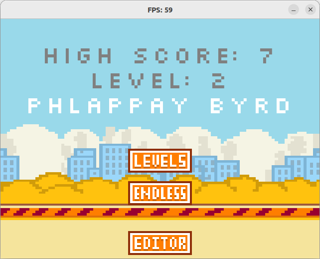
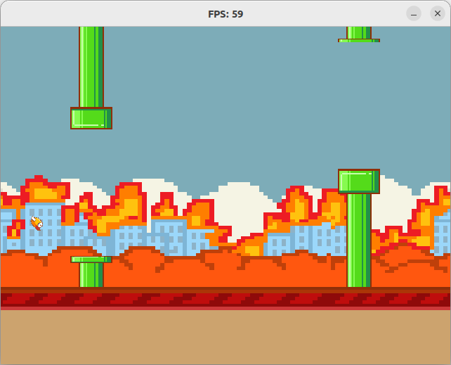
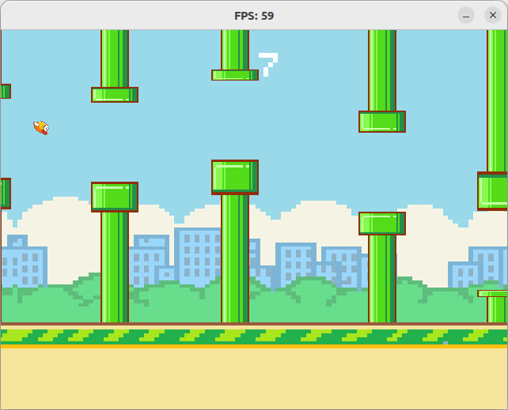
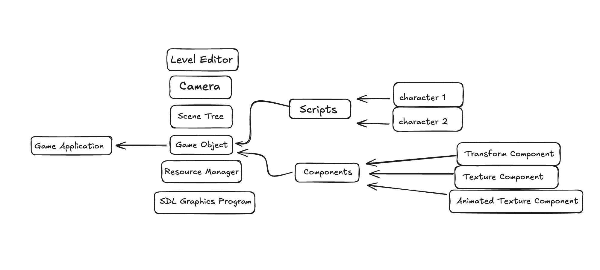

#  Phlappay Byrd Engine 
By: Lauren Lee, Ayush Tibrewal, Lailah Nabegu

---

## 📑 Table of Contents
1. [📖 Overview](#overview)   
2. [⚙️ Getting Started](#getting-started)  
3. [🚀 Demo](#demo) 
4. [📜 Documentation](#documentation)
5. [📐 Architecture](#architecture)   
6. [⚰️ Post Mortem](#post-mortem)  

---

## 📖 Overview
For our final project, we decided to create an engine develop their own version of Phlappay Byrd. There is also a level editor GUI that allows users to design all 3-levels of their game, add and delete pipes, and change pipe gap, and game speed. In the demo section, there is a video with a showing a Phlappay Byrd game we built that takes advantage of our engine tools.  
 
---

## ⚙️ Getting Started

Make sure that SDL2 and SDL_ttf are installed. You may also need to install pygame with `pip install pygame` for the level editor.

You can clone the project through this link: https://github.com/Spring25BuildingGameEngines/finalproject-rawr.git

There is a compiled binary, `finalproject-rawr/Engine/bin/prog_sdl`, which you should run from within the Engine directory (but not within bin). To recompile and execute, simply run `dub`.

---

## 🚀 Demo
[DEMO VIDEO](https://youtu.be/LoDTuehBhoo)

---

## 📜 Documentation
<a href="app.html" target="_blank">App</a>

<a href="camera.html" target="_blank">Camera</a>

<a href="component.html" target="_blank">Component</a>

<a href="gameapplication.html" target="_blank">GameApplication</a>

<a href="gameobject.html" target="_blank">GameObject</a>

<a href="resourcemanager.html" target="_blank">ResourceManager</a>

<a href="scenetree.html" target="_blank">SceneTree</a>

<a href="script.html" target="_blank">Script</a>

<a href="sdl_abstraction.html" target="_blank">SDLAbstraction</a>

<a href="text.html" target="_blank">Text</a>

---

## 📐 Architecture

---

## ⚰️ Post Mortem
We're generally pretty happy with what we were able to get done in a month. We were able to recreate an old game that users can customize, and we worked pretty efficiently to do so!
However we would've definitely liked to add more options for customizing (ex: changing backgrounds/sprites, modifying physics, and adding levels). It would have been fun to develop a more general-purpose engine for horizontal scroll games, where people could even import their own game logic or scripts. 

If we had more time, we could have made the logic more modular and extensible so that at least players could upload assets and define more rules of the game. We also could have added sound and camera effects. We implemented the camera to function as a wrapper around the SDL RenderCopy and RenderCopyEx functions, so adding additional transformations based on user scripting or game events would be very feasible. There is also a lot of room for user scripting in the endless mode where the random generation of pipes can have further structure/complexity. Nonetheless, this project was a great opportunity to combine many of the concepts we learned this semester to make a fun game. We hope you enjoy Phlappaying!
